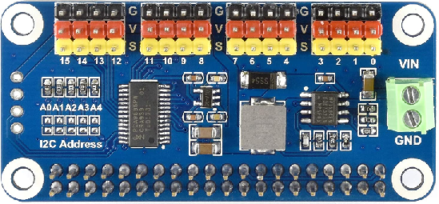
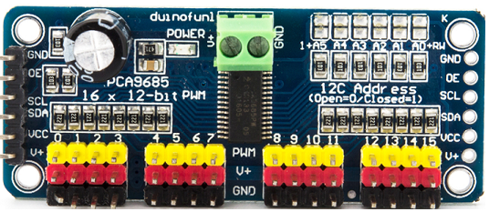

# node-red-contrib-iiot-rpi-pca9685

[](https://nodered.org)
[](https://www.raspberrypi.com/)


[](https://www.paypal.com/cgi-bin/webscr?cmd=_s-xclick&hosted_button_id=ZDRCZBQFWV3A6)

A Node-Red node for pca9685 16-Channel pwm/servo driver<br>



Example  **pca9685** hat from [WAVESHARE](https://www.waveshare.com/servo-driver-hat.htm)



Example **pca9685** module

## Nodes
- **pca9685-pwm**: Generate pwm.
- **pca9685-svr**: Controls analog or digital servo.

## Installation
Install with Node-Red Palette Manager or npm command:
```
cd ~/.node-red
npm install node-red-contrib-iiot-rpi-pca9685
```

## Usage
- This node works on Raspberry Pi with 32bit or 64bit OS.
- PWM frequency 24Hz to 1526Hz.
- Servo timing can be set.
- Servo frequency 50Hz or 290Hz.
- Consult servo manual for timing.
- Enable I2C with raspi-config.

[CHANGELOG](CHANGELOG.md)<br>